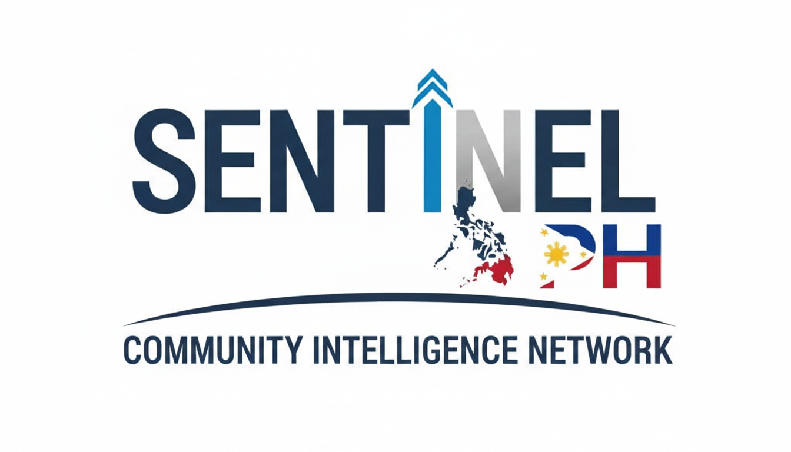
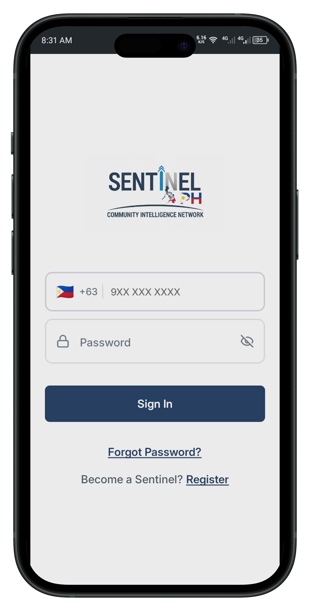
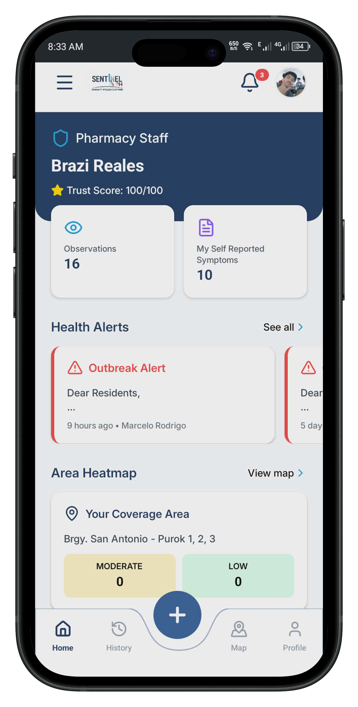
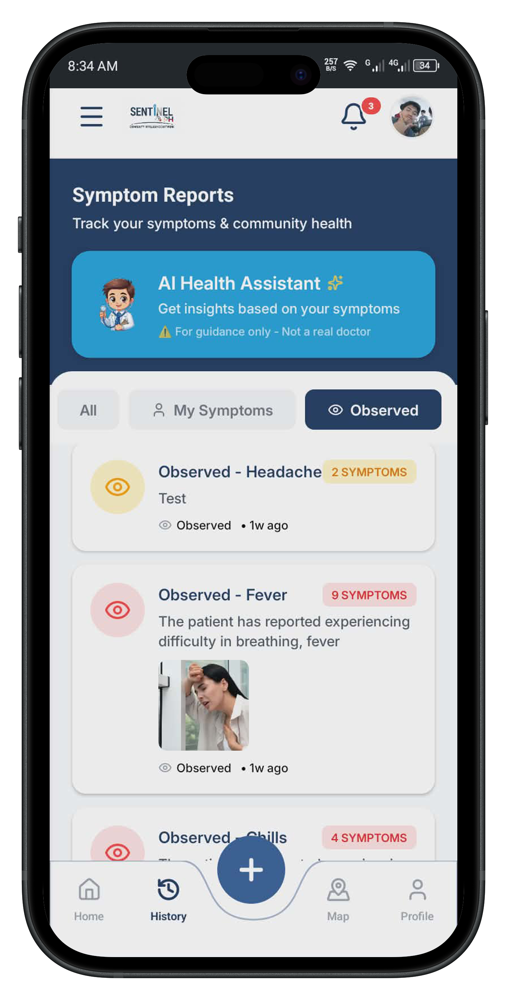
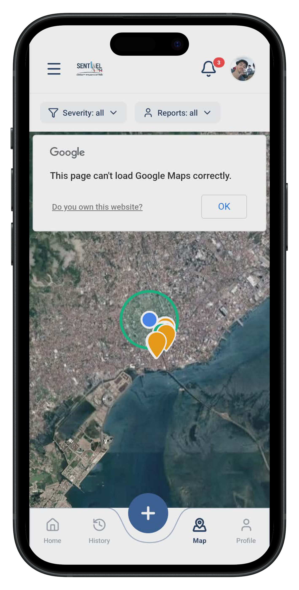
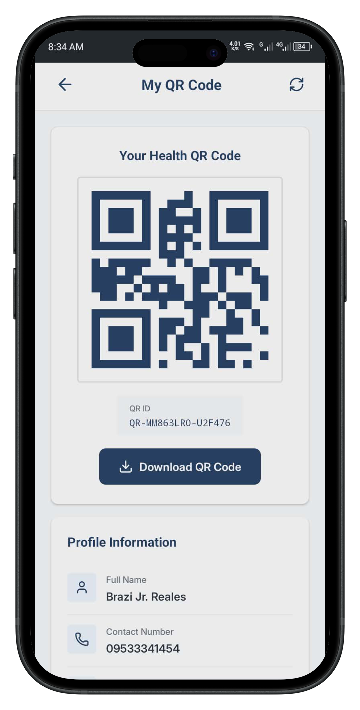

<div align="center">
  
  <h1>SentinelPH Mobile App: Community Intelligence Network for Early Outbreak Detection</h1>
</div>

<div align="center">


</div>

**Track: 3 – Good Health and Well-Being**

## 📱 App Screenshots

<div align="center">
  <h3>SentinelPH Mobile App Interface</h3>
  <p>Browse through our key screens below</p>
  
  <table>
    <tr>
      <td align="center" width="20%">
        
        <br />
        <strong>🔐 Login Screen</strong>
        <br />
        <sub>Secure access to your health network</sub>
      </td>
      <td align="center" width="20%">
        
        <br />
        <strong>🏠 Home Screen</strong>
        <br />
        <sub>Personalized health dashboard</sub>
      </td>
      <td align="center" width="20%">
        
        <br />
        <strong>📝 Report Screen</strong>
        <br />
        <sub>Quick symptom reporting</sub>
      </td>
      <td align="center" width="20%">
        
        <br />
        <strong>🗺️ Map Screen</strong>
        <br />
        <sub>Real-time outbreak heatmap</sub>
      </td>
      <td align="center" width="20%">
        
        <br />
        <strong>📱 QR Screen</strong>
        <br />
        <sub>Digital health passport</sub>
      </td>
    </tr>
  </table>
  
  <div align="center">
    <h4>🏷️ Feature Badges</h4>
    <p>
      
      
      
      
      
      
    </p>
  </div>
</div>

<br />

## 🎯 Problem Statement

The Philippines has no shortage of health data—it has a shortage of the right data at the right time. The current approach to outbreak detection is reactive, seeing outbreaks only after hospital admissions spike—when it's already too late for prevention. Communities themselves—the people who notice the first fever, the first child with diarrhea, the first neighbor who looks sick—have no structured way to share what they see.

**Current System Inefficiencies:**
- **Manual Reporting Delays** - Paper-based reports take weeks to process and reach health authorities
- **Health Center Bottlenecks** - Long waiting times during outbreak investigations while cases multiply
- **Repetitive Data Collection** - BHWs repeatedly ask the same questions during health visits, wasting valuable time
- **Information Silos** - Resident health histories scattered across different systems with no centralized access
- **Delayed Response** - Critical time lost between symptom onset and official health response

## 💡 Solution

SentinelPH builds a community intelligence network that trains everyday Filipinos—sari-sari store owners, tricycle drivers, market vendors, traditional hilots, and religious leaders—to become the first line of outbreak detection in their neighborhoods. Each resident receives a unique QR code that health workers, partner clinics, and authorized healthcare providers can scan to instantly access complete health profiles, self-reported symptoms, verified health trends, and real-time pattern analysis—transforming weeks of manual processing into seconds of digital intelligence with built-in safeguards that separate genuine signals from noise and misinformation.

**Digital QR Health Passport:** When residents visit potential healthcare partners (clinics, hospitals, pharmacies), their QR code provides instant access to their health data—eliminating repetitive questioning and enabling faster, more informed medical responses.

## 👥 Target Users

**Primary Users (Community Sentinels):**
- Sari-Sari Store Owners & Market Vendors
- Tricycle Drivers & PUV Operators
- Barangay Tanods & Leaders
- Religious Leaders & Church Workers
- Traditional Healers & Hilots
- Barangay Health Workers (BHWs)

**Beneficiaries:**
- Entire Communities (faster detection = faster response)
- Vulnerable Populations (elderly, children, pregnant women, PWDs)
- Municipal & Provincial Health Officers
- Department of Health & Epidemiologists

## 📱 MVP Core Features (Mobile App)

The initial release of the SentinelPH mobile app focuses on providing a seamless and intuitive experience for community sentinels. The app is built as a Progressive Web App (PWA) for easy access and low-bandwidth resilience.

### For Community Sentinels (Mobile App)
The app is designed around five core tabs, making navigation simple and intuitive:

**🏠 Home Screen**
- Displays a personalized health summary and the user's current status
- Provides a quick overview of recent activity and key health metrics for the user's household
- Quick-access buttons for reporting and viewing history

**➕ Report Symptom**
- A dedicated, easy-to-use form for quickly reporting health observations
- Users can specify if the report is for themself or an observation of someone in the community
- Captures key symptoms and basic location data to fuel the intelligence network
- Offline-capable with auto-sync when connectivity returns

**📜 Report History**
- A complete, chronological log of all symptoms and observations the user has previously reported
- Allows users to track their own and their family's health trends over time
- Serves as a personal health record that can be referenced during healthcare visits
- Filterable by date, symptom type, and household member

**📢 Announcements**
- A real-time information feed for receiving critical updates
- Displays live announcements and outbreak alerts broadcast by Barangay Health Workers (BHWs)
- Includes a directory of BHWs with direct hotlines and emergency contacts
- Delivers push notifications for urgent health advisories

**🗺️ Public Map**
- An interactive, anonymized community intelligence tool
- Shows a geographic visualization of recently verified reports in the area
- Helps users see what symptoms are circulating in their community, promoting awareness and early precaution
- Uses clustering to show the density of observations without compromising individual privacy
- Color-coded heat layers for different symptom categories

**📱 QR Code Scanner**
- Scan QR codes for instant health profile access
- View verified health information of family members
- Share health data securely with healthcare providers
- Quick check-in at partner clinics and pharmacies

### 🏥 For Barangay Health Workers (BHW Dashboard)
To support the sentinel network, BHWs have access to a powerful web dashboard for managing and responding to community intelligence.

- **Sentinel Management** - Approve or reject community sentinel applications
- **Real-time Observations** - Live monitoring of incoming reports with trend analysis
- **QR Code Scanner** - Scan a resident's QR code for instant access to their health profile and history
- **Interactive Mapping** - Real-time outbreak visualization to identify emerging clusters
- **Community Announcements** - Broadcast health advisories and alerts to residents in their jurisdiction

## ✨ Key Innovations

- 📱 **Mobile-First PWA** - Works offline and is optimized for low-bandwidth environments
- 🔒 **AI-Powered Trust Scoring** - Validates sentinel reliability (0-100 score) to filter noise
- ✅ **3-Sentinel Rule** - Requires multi-source validation from unrelated observers before triggering alerts
- 🗺️ **Observation Heatmaps** - Real-time geographic clustering to visualize disease spread
- 🔄 **Two-Way Feedback Loop** - Communities receive acknowledgments and advisories, closing the communication loop
- 🛡️ **Multi-Layered Spam Prevention** - Employs rate limiting, behavior monitoring, and AI filtering
- 🎯 **Proximal Intelligence** - Catches outbreaks at the pre-clinic stage by tapping into community observations
- 🏆 **Incentive System** - Motivates participation through load credits, recognition badges, and community rankings

## 🏗️ Tech Stack

**Frontend:**
- React 18.3 + TypeScript 5.6
- Vite 6.0
- Tailwind CSS + Framer Motion
- Progressive Web App (PWA)
- Axios for HTTP requests

**Backend & Database:**
- Firebase (Authentication, Firestore, Cloud Functions, Hosting)
- Real-time data synchronization

**AI/ML Components:**
- Trust Score Engine
- DBSCAN Spatial Clustering
- NLP for observation categorization (GPT API)
- Anomaly Detection & Spam Classification

**Integrations:**
- Google Maps API (observation heatmaps)
- Twilio API (SMS alerts)
- Cloudinary (Image upload & management)
- Telecom partnerships (for load credit incentives)

## 📂 Project Structure

```
Sentinel-PH-App/
├── @types/                    # TypeScript type definitions
├── assets/                    # Static assets
│   ├── fonts/                # Custom fonts (Inter)
│   └── logo/                 # App logo
├── components/               # Reusable components
│   ├── camera/              # Camera components
│   │   ├── IDScannerCamera.tsx
│   │   └── SelfieCamera.tsx
│   ├── registration/        # Multi-step registration components
│   │   ├── PersonalDetailsStep.tsx
│   │   ├── DocumentVerificationStep.tsx
│   │   ├── CredentialsStep.tsx
│   │   ├── RegistrationModals.tsx
│   │   └── index.ts
│   ├── screens/             # Screen components
│   │   └── SplashScreen.tsx
│   └── ui/                  # UI components
│       ├── Alert.tsx
│       ├── Avatar.tsx
│       ├── Badge.tsx
│       ├── Button.tsx
│       ├── Card.tsx
│       ├── Checkbox.tsx
│       ├── Divider.tsx
│       ├── Input.tsx
│       ├── Spinner.tsx
│       ├── StepIndicator.tsx
│       ├── Switch.tsx
│       └── index.ts
├── config/                   # Configuration files
│   └── firebase.ts          # Firebase config
├── constants/               # App constants
├── context/                 # React context providers
│   ├── AuthContext.tsx      # Authentication context
│   └── index.ts
├── hooks/                   # Custom React hooks
├── lib/                     # Library integrations
│   └── firebase.ts         # Firebase initialization
├── navigation/              # Navigation setup
├── screens/                 # App screens
│   ├── LoginScreen.tsx
│   ├── RegisterScreen.tsx
│   ├── MultiStepRegisterScreen.tsx
│   └── index.ts
├── services/                # API services
├── theme/                   # Theme configuration
├── utils/                   # Utility functions
├── App.tsx                  # Main app component
├── app.json                 # Expo configuration
├── tailwind.config.js       # TailwindCSS config
└── package.json             # Dependencies
```

## 🚀 Getting Started

### Prerequisites
- Node.js (v18+)
- pnpm
- A Firebase project

### Installation

1. **Clone the repository:**
```bash
git clone https://github.com/your-username/sentinelph.git
cd sentinelph
```

2. **Install frontend dependencies:**
```bash
pnpm install
```

3. **Set up environment variables:**
```bash
# Copy .env.example to .env
# Fill in your Firebase and other service credentials
```

4. **Run the development server:**
```bash
pnpm run dev
```

## 💰 Revenue Model

**LGU & Health System Subscriptions (85%):**
- **Barangay Plan:** ₱300/month (up to 20 sentinels)
- **Municipal Plan:** ₱1,500/month (unlimited sentinels, advanced analytics)
- **Provincial Plan:** ₱4,000/month (regional pattern detection, API access)

**Partnerships & Services (15%):**
- Telecom partnerships (load credit revenue share)
- NGO health program integration
- Corporate CSR sponsorship
- Training & certification services

## 🎨 Design System

### Colors
- **Primary:** `#1B365D` (Navy Blue)
- **Secondary:** `#20A0D8` (Sky Blue)
- **Background:** `#FFFFFF` (White)

### Typography
- **Font Family:** Inter
  - Light (18pt)
  - Medium (18pt)
  - SemiBold (24pt)

## 📝 Scripts

```bash
pnpm start          # Start development server
pnpm run dev        # Start development server
pnpm android        # Run on Android
pnpm ios            # Run on iOS
pnpm web            # Run on web
pnpm lint           # Lint code
pnpm format         # Format code with Prettier
```

## 🤝 Contributing

Contributions are welcome! Please feel free to submit a Pull Request.

## 📄 License

This project is part of the Innovation Cup Hackathon.

---

<div align="center">
  <strong>Built for Innovation Cup Hackathon | Empowering Communities, Protecting Health</strong><br>
  Made with ❤️ for Innovation Cup Hackathon
</div>
